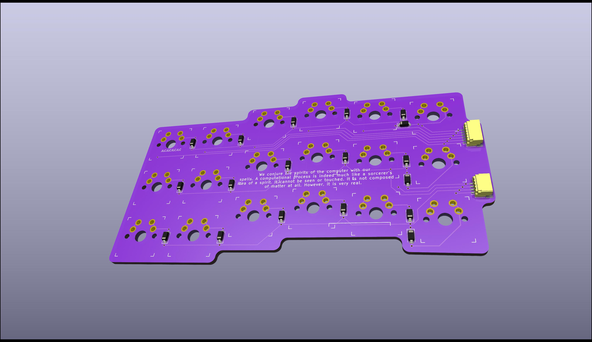

# Stone Patterns Keyboard

A configurable ergonomic keyboard test-bed. Parts are connected with JST SH cables (6 pin and 4 pin) to a center module containing the MCU. The intent is to glue magnets to the bottom of the PCBs and move them around a thin steel board until I'm happy with the configuration and ready to build a case.

